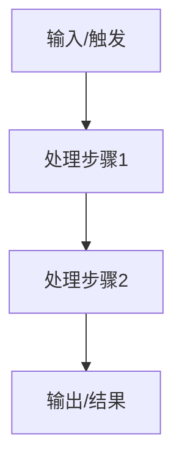

# 深度学习笔记生成器

为用户着重学习的主题生成一份详细的 markdown 学习笔记，保存为独立文件。

## 何时使用

当用户出现以下意图时，启用本技能：
- 说"这个我要重点学"、"生成学习笔记"、"详细记录这个"、"帮我深入整理"、"这个知识点记一下"
- 在生成每日总结时，识别到有"学习/研究/理解"性质的重点内容，主动建议并生成

## 保存路径

文件保存到当天的日期目录：`D:\project\dsh\couple-site\couple-site-self-learning-docs\YYYY-MM-DD\`

文件名格式：`{主题简短英文或拼音}.md`（不需要日期前缀，因为已在日期目录内）

示例：`D:\project\dsh\couple-site\couple-site-self-learning-docs\2026-09-12\virtual-scrolling.md`

## 输出格式

```markdown
# {主题} — 学习笔记

> 日期：YYYY-MM-DD
> 关联每日总结：[daily.md](daily.md)

## 一、核心概念

（详细解释这个知识点/技术/业务是什么，解决什么问题）

## 二、原理与流程

（有数据流转或业务流程时，用 mermaid 绘制流程图）



（配合文字说明每个节点的含义和关键逻辑）

## 三、我的思考

> _（AI 根据今天对话中用户的发言、提问、困惑提炼出用户的思考和理解，用引用块 + 斜体呈现，与 AI 生成内容区分。用户可在此基础上补充修改。）_

## 四、规范总结

（AI 生成的更结构化、更规范的版本，可用于复习或分享）

## 五、延伸 / 待验证

- 相关概念或技术
- 需要进一步确认或实践的点
```

## 写作规则

- **核心概念**：要详细，把"是什么、为什么、怎么用"讲清楚
- **流程图**：有数据流转或多步骤流程时必须画 mermaid 图；纯概念类可省略。优先用 `graph TD`（流程图），涉及时序用 `sequenceDiagram`
- **我的思考**：根据对话中用户的真实发言提炼，不要编造。用 `> _..._` 格式（引用块 + 斜体），确保和 AI 内容视觉区分。如果用户没有明显的思考表达，写"_（待补充）_"
- **规范总结**：用结构化的要点形式，便于复习
- **语言**：和用户交流的语言一致，保留关键术语和项目名

## 与每日总结的联动

生成学习笔记后，在每日总结对应位置用文件名引用（每日总结与学习笔记在同一日期目录下）：

```markdown
- 深入学习了虚拟滚动，详见 [学习笔记：虚拟滚动](virtual-scrolling.md)
```

注意：每日总结（`daily.md`）和学习笔记（`{主题}.md`）都保存在 `D:\project\dsh\couple-site\couple-site-self-learning-docs\YYYY-MM-DD\` 下，互相引用直接写文件名即可。
