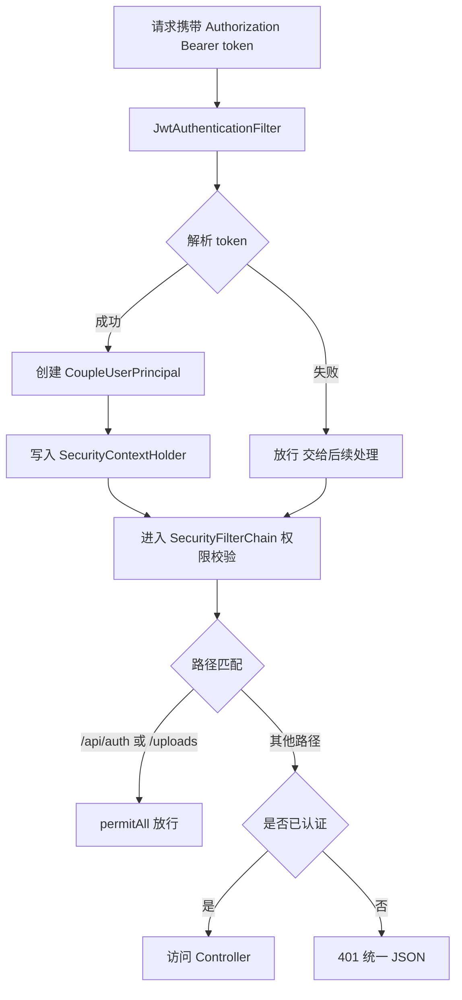

# 认证与安全（JWT + Security）— 学习笔记

> 日期：2026-09-09
> 关联每日总结：[daily.md](daily.md)

## 一、核心概念

项目使用 **无状态 JWT 认证**：登录后签发 token，每次请求携带 token，`JwtAuthenticationFilter` 解析并设置认证上下文，Spring Security 基于它做权限控制。

三个关键组件：

| 组件 | 作用 |
|---|---|
| `CoupleUserPrincipal` | `record` 类型认证实体 `(id, username, coupleId)`，不可变，作为请求上下文 |
| `JwtAuthenticationFilter` | 从请求头解析 token，成功则创建 Principal 写入 SecurityContext，失败放行交给后续 |
| `SecurityConfig` | 关闭 CSRF、无状态会话；放行 `/api/auth/**`、`/uploads/**`；其余需认证；401/403 统一 JSON |

**构造器注入**：字段 `final` + 单一构造器时 Spring 自动注入。好处：依赖不可变、完全初始化保证、强制契约、循环依赖快速失败、参数过多时提示违反单一职责。

## 二、原理与流程

**Security 配置要点**：
1. `.csrf(disable)` — JWT 无状态，不需要 CSRF token
2. `.sessionManagement(STATELESS)` — 不存 Session
3. `.authorizeHttpRequests` — `/api/auth/**`、`/uploads/**` 放行，其余 `authenticated()`
4. `.exceptionHandling` — `authenticationEntryPoint`(401) / `accessDeniedHandler`(403) 返回统一 JSON
5. `addFilterBefore(jwtFilter, UsernamePasswordAuthenticationFilter.class)` — 保证在用户名密码认证前执行
6. CORS：从配置读允许来源（逗号分隔），允许所有方法/头，携带凭证
7. `passwordEncoder`：BCrypt 加密

**`record` 类型**：Java 14 引入、Java 17 正式发布。自动提供全参构造、`id()` 访问器（非 `getId()`）、`hashCode/toString`，不可 set（数据不可变），适合做认证上下文——设置一次，全程可用。

## 三、我的思考

> _我之前一直不太理解为什么不推荐 @Autowired 字段注入、而推荐构造器注入，笔记里也没真正琢磨透"会产生什么问题"。通过这次梳理明白了：构造器注入保证依赖 final+完全初始化，还能快速暴露循环依赖，是一种更明确的契约。record 用来承载认证主体这种不可变数据非常契合，只读一次、全程可用。_

## 四、规范总结

- JWT 过滤器职责单一：解析 token → 成功建 Principal → 失败放行
- Security 链式配置 6 步：CSRF 关 / 无状态 / 路径权限 / 异常 JSON / 过滤器位置 / CORS
- 放行原则：登录认证类接口 + 静态资源（`` 无法带 token）必须放行，其余业务接口一律认证
- 构造器注入优于字段注入（final、契约、循环依赖检测）
- `record` 替代无脑 POJO 作为不可变数据载体

## 五、延伸 / 待验证

- JWT 过期时间 / 刷新 token 机制
- `/uploads/**` 放行后如何做权限加固（UUID 文件名 → 签名 URL → 走后端接口）
- `SecurityContextHolder` 的线程隔离机制（后续异步线程取认证信息的坑）