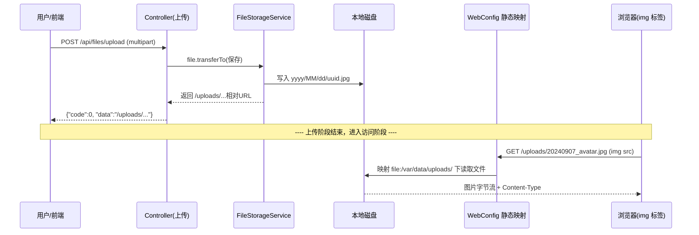

# 文件上传与静态资源映射链路 — 学习笔记

> 日期：2026-09-09
> 关联每日总结：[daily.md](daily.md)

## 一、核心概念

用户上传图片后，图片保存到本地服务器磁盘，通过"静态资源映射"让浏览器直接通过 URL 访问。涉及两端：

**上传端**（`LocalFileStorageServiceImpl`）：
- 校验 contentType 以 `image/` 开头、大小 ≤ 10MB
- 按 `yyyy/MM/dd` 建子目录，`UUID` 文件名保留扩展名
- 返回相对 URL `/uploads/yyyy/MM/dd/uuid.jpg`

**访问端**（`WebConfig` 静态资源映射）：
- `addResourceHandler("/uploads/**")` → `addResourceLocations("file:" + 绝对路径 + "/")`
- 浏览器请求 `/uploads/**` 时 Spring 自动从磁盘读文件返回

## 二、原理与流程

**完整数据链路要点**：
1. `POST /upload` → Controller → `file.transferTo()` 保存到磁盘
2. 前端拿到相对 URL 后，用 `` 重新请求
3. Spring 静态资源处理器 `ResourceHttpRequestHandler` 匹配映射规则，组合完整路径
4. IO/NIO 读取文件，自动设置 `Content-Type`、`Cache-Control`，流式返回
5. 底层可用零拷贝优化大文件

**工具类**：`Paths.get(uploadDir).toAbsolutePath().normalize()` 将相对路径解析为绝对路径；`Paths` 常与 `Files` 搭配使用。

## 三、我的思考

> _用户上传文件之后返回 URL，前端再拿 URL 请求，Spring 会做路径映射、以二进制流方式读取资源文件——整个链路我最开始是割裂理解的，实际补全后才发现上传和访问是两个独立的阶段。对删除文件采用"尽力而为"策略（删除失败不阻断业务）这个设计也很有意思，避免小失败影响主流程。_

## 四、规范总结

- 上传校验：类型（`image/` 前缀）+ 大小（≤10MB），用 `Locale.ROOT` 保证大小写转换跨环境一致
- 存储：`yyyy/MM/dd` 分目录 + UUID 文件名，避免重名/猜名
- 扩展名：`contentType → EXT_MAP` 映射，未知类型回退从原始文件名提取，再兜底 `.jpg`
- 访问：`WebConfig implements WebMvcConfigurer` 注册 `/uploads/** → file:` 映射
- 删除：`url.startsWith("/uploads/")` 白名单校验后 `Files.deleteIfExists`，失败静默

## 五、延伸 / 待验证

- 魔数（文件头）验证 vs 单纯校验 contentType（更快、更可靠）
- 大文件异步删除可避免阻塞主请求
- 后续可升级 OSS/S3 签名 URL，替换本地磁盘存储
- Maven 插件启动乱码问题的排查（编码：`project.build.sourceEncoding=UTF-8`）