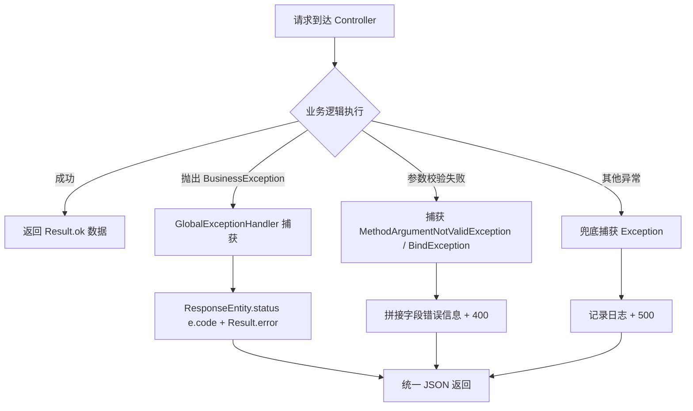

# 全局异常处理体系 — 学习笔记

> 日期：2026-09-09
> 关联每日总结：[daily.md](daily.md)

## 一、核心概念

Spring Boot 后端通常需要"统一返回体 + 统一异常处理"，否则 Controller 每个方法都要手写 try-catch，错误格式五花八门。本项目用四个组件搭出一套完整的异常处理体系：

| 组件 | 职责 |
|---|---|
| `Result<T>` | 统一响应体 `{code, message, data}`，业务状态码约定：0 成功 / 400 参数错误 / 401 未登录 / 403 无权限 / 500 服务器错误 |
| `BusinessException` | 业务异常，携带 `code` 与 `message`，Controller 主动抛出 |
| `GlobalExceptionHandler` | `@RestControllerAdvice`，捕获 Controller 层抛出的异常统一封装 |
| `ResponseEntity` | 精确控制 HTTP 状态码、响应头、响应体，让 HTTP 状态码与 body.code 一致 |

## 二、原理与流程

**关键注解 `@RestControllerAdvice`** = `@ControllerAdvice` + `@ResponseBody`，所以处理器的返回仍会封装成 JSON。

**为什么用 `ResponseEntity`**：不是所有请求都返回 HTTP 200。通过 `ResponseEntity.status(code)` 让 HTTP 状态码和业务码一致，符合 RESTful 风格。

**参数校验失败**的处理：从 `e.getBindingResult().getFieldErrors()` 取所有字段错误，提取注解里的 `message`（如 `@NotBlank(message = "用户名不能为空")`），用 `;` 拼接成一条错误信息。

## 三、我的思考

> _我在 W2 里学会了泛型方法级别声明 `<T>`，静态方法不依赖实例，会根据传入参数自动推导类型。刚开始不理解 ResponseEntity 存在的意义，后来明白它是为了"精确控制状态码"，让返回给客户端的 HTTP 状态码和 body 里的 code 保持统一，这比所有请求都返回 200 更符合 RESTful 风格。_

## 四、规范总结

- 统一响应体 `Result<T>`：`code/message/data`，约定 0/400/401/403/500
- `BusinessException(code, message)`：业务层主动抛出，语义明确
- `GlobalExceptionHandler`：一个 `@ExceptionHandler` 对应一类异常
  - `BusinessException` → 原样返回 code
  - 参数校验异常（两种）→ 400 + 拼接错误信息
  - `Exception` → 500 + 日志记录（兜底）
- `ResponseEntity`：HTTP 状态码 = body.code

## 五、延伸 / 待验证

- `BindException`（表单/Query 参数）与 `MethodArgumentNotValidException`（JSON body）的区别
- 自定义校验注解（`@Valid` 深度用法）
- 以后可以扩展：未登录时返回 401 的分支（与 Security 结合）