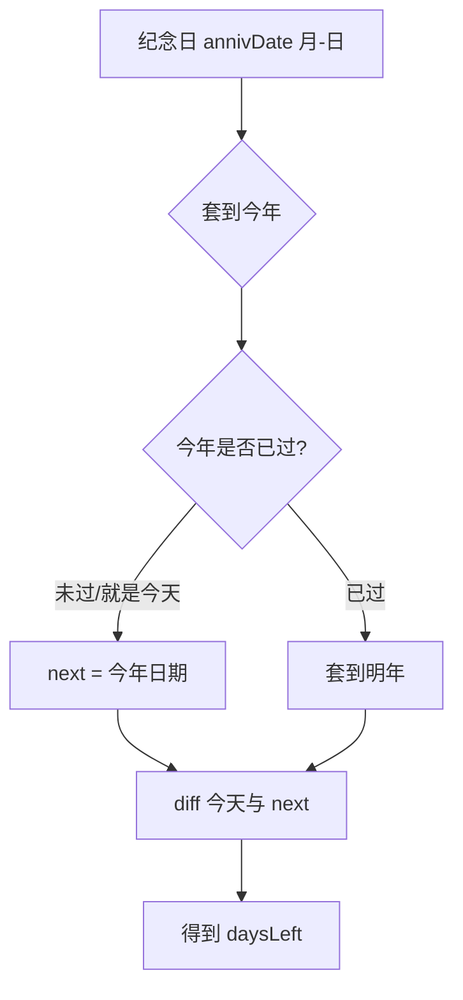

# 纪念日天数计算与业务设计 — 学习笔记

> 日期：2026-09-10
> 关联每日总结：[daily.md](daily.md)

## 一、核心概念

情侣网站里有两种时间概念，**非常容易被混淆**：

| 类型 | 例子 | 归属 | 特点 |
|---|---|---|---|
| **纪念日（每年重复）** | 生日、在一起、结婚纪念日 | 纪念日页 | 关注"月-日"，永远有下一个，需要提醒 |
| **事件记录（一次性）** | 2023-09-30 去旅行 | 首页时间轴 moments | 关注完整年月日，只发生一次 |

**天数计算核心思路**：把"月-日"套到今年，如果今年已过就套到明年，再和今天算差值。

## 二、原理与流程



**前端实现**：
```js
function daysLeft(item) {
  const today = dayjs().startOf('day')
  const date = dayjs(item.date).startOf('day')
  let next = date.year(today.year())
  if (next.isBefore(today)) next = next.add(1, 'year')
  return next.diff(today, 'day')
}
```

**后端实现（关键差异）**：
```java
private LocalDate nextOccurrence(LocalDate anniversaryDate, LocalDate today) {
    LocalDate thisYear = withYearSafe(anniversaryDate, today.getYear());
    if (!thisYear.isBefore(today)) {   // 注意是 !isBefore，而不是 isAfter！
        return thisYear;
    }
    return withYearSafe(anniversaryDate, today.getYear() + 1);
}
```

**边界情况**：

| 情况 | 处理 |
|---|---|
| 就是今天 | `daysLeft = 0`，显示"就是今天 🎉" |
| 今年已过 | 套到明年 |
| **2/29 遇平年** | `withYearSafe` 归到 2/28（catch DateTimeException） |
| 时分秒影响 | 前端 `.startOf('day')` 归零 |

**注意坑**：后端 `isAfter` 要改成 `!isBefore`，否则"今天"会被算成明年。

## 三、我的思考

> _这个模块是我自己先设计了五种问题框架（是什么/有哪几种/用户能做什么/系统自动做什么/边界怎么处理）再动手的，比如"纪念日"和"事件记录"本质是不同的事物：一个每年重复关注月-日，一个一次性关注完整日期。到实现天数计算时，体会最深的是"把明年/今年/今天"三种情况都想全，尤其 2/29 这种闰年边界如果不处理，平时根本没有声音，只有到日期才会炸。_

## 四、规范总结

- 两种概念区分：纪念日(月-日,循环) vs 事件(年月日,一次性)
- nextOccurrence：今年 → 已过套明年 → 2/29 平年回退 2/28
- 判断条件用 `!isBefore` 而非 `isAfter`（避免当日被算做明年）
- 前端 dayjs 一定 `.startOf('day')` 归零再参与天数计算
- 业务设计五问框架：定义/分类/操作/自动化/边界

## 五、延伸 / 待验证

- 2/29 到平年 2/28 的"误差一天"用户是否可感知
- `remindDays=0`（当天提醒）的边界场景
- 前后端计算口径必须一致（后面抽了 util 统一）