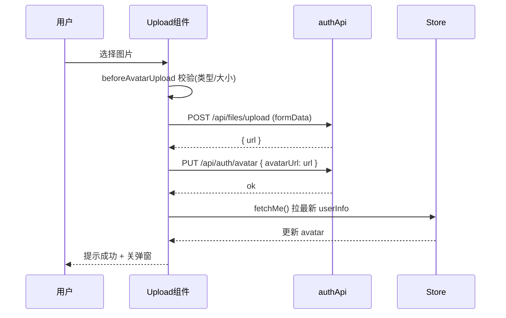

# 头像上传完整链路（前端）— 学习笔记

> 日期：2026-09-10
> 关联每日总结：[daily.md](daily.md)

## 一、核心概念

前端头像上传不是一个请求，而是一条**四步链路**：

```
① 校验（beforeAvatarUpload）类型 image/* + 大小 ≤ 10MB
② 上传文件（POST /api/files/upload, el-upload 直连, 手动带 token）
③ 保存头像（PUT /api/auth/avatar, 传 avatarUrl）
④ 刷新状态（GET /api/auth/me, userStore.fetchMe()）
```

三个接口分工明确：

| 接口 | 作用 |
|---|---|
| `/api/files/upload` | 上传图片文件，返回 url |
| `/api/auth/avatar` | 把 url 设为用户头像 |
| `/api/auth/me` | 拉最新用户信息 |

## 二、原理与流程



**为什么必须 fetchMe**：上传+保存后，`userInfo.avatar` 还是旧数据。只有弹窗里的 `avatarPreview`（本地 preview）变了，其他所有用 `userInfo.avatar` 的地方都不变。必须重新拉取用户信息刷新 store。

**为什么 el-upload 要手动带 token**：`el-upload` 是**直连上传**（内部自己发 XHR），**不走封装的 axios**，所以 axios 拦截器自动加 token 的逻辑对它不生效，必须通过 `:headers` 手动传：
```js
const uploadHeaders = computed(() => ({ Authorization: `Bearer ${userStore.token}` }))
```

## 三、我的思考

> _最让我意外的是"为什么必须 fetchMe"和"为什么 el-upload 要手动带 token"这两个点。它们其实是同一个问题的两面：走了不在统一封装里的通道（本地 preview / 原生 XHR），就享受不到已有的统一逻辑（store 响应式 / axios 拦截器）。以后遇到"某个组件行为和其他组件不一致"时，先查它是不是绕过了统一封装。_

## 四、规范总结

- 四步链路：校验 → 上传 → 保存 URL → 刷新状态
- 三个接口职责分离：文件上传 / 头像绑定 / 用户信息拉取
- el-upload 直连上传必须 `:headers` 手动带 token
- 保存后必须 fetchMe 刷新 store，否则头像不变
- store 本来就是"多个组件共享"的响应式来源，改一处全处生效

## 五、延伸 / 待验证

- el-upload 的 `http-request` 自定义上传（完全接管请求，可走统一 axios）
- 上传进度条（on-progress）与取消上传
- 与后端 `/uploads/**` 放行的关系（静态资源 `` 无法带 token）