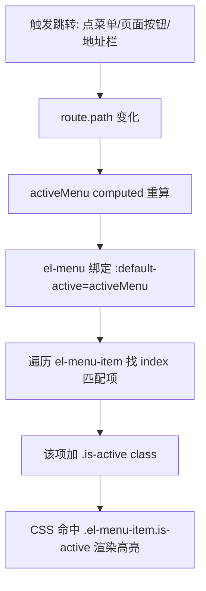

# Layout 布局与菜单高亮跟路由 — 学习笔记

> 日期：2026-09-10
> 关联每日总结：[daily.md](daily.md)

## 一、核心概念

`Layout.vue` 是项目的主布局组件：

```
el-container.layout
├── el-aside (左侧菜单栏, 220px)
│   ├── .logo (💕 我们的小窝)
│   └── el-menu (导航菜单)
└── el-container.layout-right
    ├── el-header (顶部栏: 绑定提示 + 头像 + 昵称 + 退出)
    └── el-main  (router-view 主内容区)
+ el-dialog (更换头像弹窗)
```

**菜单高亮本质**：高亮是**响应 `route.path` 变化**而不是"响应点击菜单"。`el-menu` 的 `router` 属性让点击菜单项自动 `router.push(index)`，`activeMenu` 计算属性跟随 `route.path`，`el-menu` 用 `:default-active` 拿到当前高亮的 index，遍历 items 找到匹配项加 `.is-active`。

## 二、原理与流程



**三家分工**：
- `el-menu` 的 `router` 属性 → 负责路由跳转
- `el-menu-item` 的 `index` → 身份标识，用于匹配
- `activeMenu` + `:default-active` → 决定"该高亮谁"

**为什么单独处理 `/albums`**：详情页路由是 `/albums/123`，与菜单项 `/albums` 不相等，默认不会高亮，需要用 `route.path.startsWith(...)` 处理。

**`:deep()`**：穿透 scoped 样式，作用到子组件内部元素（如 el-avatar 内部）。

**`el-button` 的 `link` 属性**：去掉背景和边框，视觉重量轻，适合次要操作、文字入口（退出按钮就用它）。

## 三、我的思考

> _我一开始以为高亮是"点一下菜单它就亮了"，后来才明白它是响应式地跟随 route.path 的。这个认知转变挺关键：地址栏直接输入、前进后退都要能正确高亮，所以不能只靠点击事件。另外 detail 页和菜单项路径不一致导致的"不高亮"问题，也让我理解了为什么需要单独映射。_

## 四、规范总结

- Layout 结构：aside(菜单) + header(顶部) + main(内容)
- 高亮链路：route.path → activeMenu → default-active → index 匹配 → .is-active
- 详情页/多级路径需单独处理前缀匹配
- 顶部栏：绑定标签(未绑定时) / 头像(tooltip+首字兜底) / 昵称 / 退出(二次确认)
- `link` 按钮用于次要操作

## 五、延伸 / 待验证

- element-plus 菜单的 `collapse` 折叠模式
- 404 页与菜单高亮的兜底策略
- 头像上传的四步链路（见头像上传笔记）