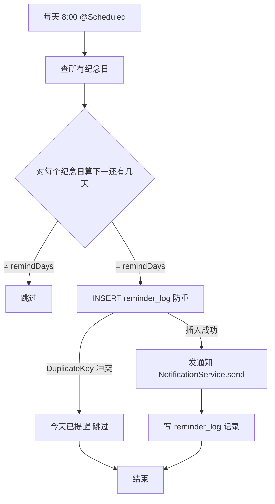

# 纪念日提醒定时任务与防重设计 — 学习笔记

> 日期：2026-09-11
> 关联每日总结：[daily.md](daily.md)

## 一、核心概念

目标：每天固定时间（8:00）检查所有纪念日，当"距离下一次还有 N 天"等于用户设置的 `remindDays` 时，发一条提醒。

```
5 月 13 日 → 距离 5 月 20 日还有 7 天 → 等于 remindDays=7 → 发提醒 ✅
5 月 14 日 → 还有 6 天 → 不等于 7 → 不发
```

**防重设计是核心**：同样一天可能被多次触发（手动触发测试、多实例部署、失败重试），必须保证"同一天对同一个纪念日只发一次"。方案是建 `reminder_log` 表，靠 **唯一索引** 兜底：

```sql
UNIQUE KEY uk_anniversary_date (anniversary_id, remind_date)
```

发提醒前先 INSERT，命中唯一约束（`DuplicateKeyException`）就说明今天已提醒过，跳过。

## 二、原理与流程



**`reminder_log` 表**（两种角色）：
- `anniversary_id`：纪念日 ID
- `remind_date`：**提醒"发生"的日期**（不是纪念日日期！）
- 唯一键 `(anniversary_id, remind_date)`：同一天同一纪念日只会插入成功一次

**`notification` 表**（站内信）：
- `user_id`（接收人，情侣双方各插一条）、`couple_id`、`type`、`title`、`content`、`related_id`、`is_read`、`created_at`
- 索引 `idx_user_read_created (user_id, is_read, created_at DESC)` 支持"查某人未读按时间倒序"

## 三、当前实现（@Scheduled）与升级路径（XXL-JOB）

| 维度 | @Scheduled（当前） | XXL-JOB（升级后） |
|---|---|---|
| 多实例 | 每个实例都跑一遍 → 重复 | 调度中心统一分发，只执行一次 |
| 改 cron | 改代码重启 | Web 界面动态改 |
| 监控 | 看日志 | 可视化控制台 |
| 失败重试 | 无 | 可配置 |
| 告警 | 无 | 支持 |

**升级核心：业务逻辑与调度解耦**。`AnniversaryReminderService.remind()` 只管"做什么"，调度器只管"什么时候做"。升级 XXL-JOB 只新增一个 `AnniversaryReminderJob`，方法体一行调用 `remind()`，Service / Mapper / 表结构全部不动。

## 四、我的思考

> _我在设计时最关心的是防重：第一天就想到了唯一键，但真正细想后发现 `reminder_log` 不只是"记录"，它天然是"幂等锁"。多实例、失败重试、手动触发都只有一条能插入成功。另外也注意到了 `notification` 类型先写死 `ANNIVERSARY_REMIND` 字符串，后续多个通知类型时再改枚举——先跑通再说。_

## 五、规范总结

- 防重三板斧：唯一索引 + INSERT 先于发送 + DuplicateKeyException 跳过
- 防重不依赖调度器（@Scheduled 可换成 XXL-JOB）
- 三层职责：调度层（@Scheduled）→ 业务层（remind）→ 通知层（send）
- 站内信：couple 下每个 user 各插一条；类型用枚举承载更优雅
- 时区注意：LocalDate.now() 用服务器时区

## 六、延伸 / 待验证

- `remind_days <= anniversary_date - today` 的限制逻辑（选择提前天数不超过距离）
- 如果`remind_days=0`（当天提醒）但当天 8:00 之后才插入纪念日，当天是否会漏发？
- 通知渠道扩展：邮件 / 短信（NotificationService 只定义接口，实现先打日志）
- 站内信完整功能（分页/未读数/已读/读全部）